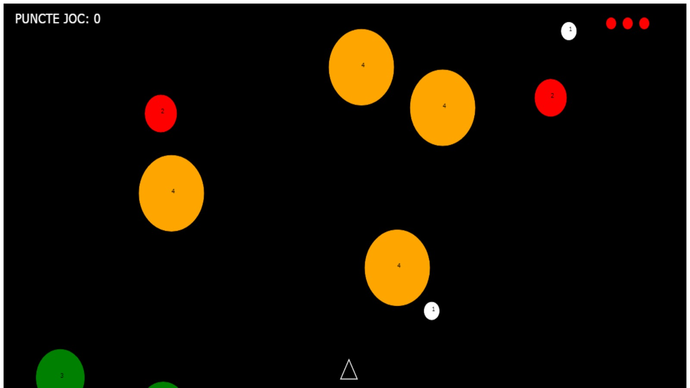

# JOC ASTEROIDS - PROIECT MULTIMEDIA 

În cadrul disciplinei **Multimedia** am realizat individual un proiect ce constă în realizarea unui **joc single-player**, respectând anumite cerințe obligatorii. Proiectul a fost notat cu punctajul maxim.

Descriere: Realizarea unui joc similar cu Asteroids (https://en.wikipedia.org/wiki/Asteroids_(video_game)) utilizând controlul de tip Canvas sau controlul de tip SVG.
 
Obiective:  
 + Realizarea unei interfețe cu utilizatorul pentru tema primită folosind limbajele HTML și CSS  
 + Atașarea de funcții de tratare pentru evenimentele controalelor utilizate  
 + Implementarea cerințelor specifice temei alocate  
  
  
*TEHNOLOGIILE UTILIZATE:*  
֍ Limbajele de programare – **HTML, CSS, JavaScript**  
֍ Mediul de dezvoltare – **Visual Studio Code**  

*CERINȚELE PROIECTULUI:*  
֍ implementare *asteroizi* (reprezentați sub formă de cerc): fiecare asteroid va avea asociată o valoare generată aleator în intervalul 1-4, indicând numărul de rachete necesar pentru distrugerea acestuia. Numărul de rachete necesare va fi afișat în permanență în cadrul desenului utilizat pentru asteroid. Culoarea și dimensiunea asteroidului se vor modifica în funcție de acest număr. Asteroizii se vor deplasa pe traiectorii liniare cu o viteză determinată aleator.  
֍ implementare *navă spațială* desenată sub formă de triunghi; nava va putea fi controlată cu ajutorul următoarelor comenzi din tastatură: săgeți (deplasare navă sus / jos / stânga / dreapta cu o viteză constantă), z – rotire spre stânga, c – rotire spre dreapta, x – lansare rachetă în direcția în care este orientată nava; nava se poate deplasa în toate cele patru direcții indiferent de orientarea curentă.  
֍ implementare *rachete*: se va reprezenta racheta pe parcursul deplasării de la nava spațială la asteroid. Se va asigura detecția coliziunii cu asteroidul și modificarea numărului de rachete necesar pentru distrugerea acestuia. Sunt permise maxim 3 rachete lansate simultan.  
֍ *coliziune între asteroizi*: coliziunea dintre doi asteroizi va determina modificarea traiectoriei acestora.  
֍ *coliziune între nava spațială și asteroizi*: va determina reducerea numărului de “vieți” și repornirea jocului, până când numărul de vieți devine 0.  
֍ regenerare număr *vieți*: la distrugerea fiecărui asteroid jucătorul va obține un număr de puncte. La atingerea unui număr predefinit de puncte, se va actualiza numărul de ”vieți”.  
֍ posibilitate control joc utilizând touchscreen  
֍ stocarea celor mai bune 5 scoruri obținute și a numelui jucătorilor cu ajutorul Web Storage API (sau a unui alt API similar)  

# CAPTURĂ DE ECRAN DIN INTERFAȚĂ

